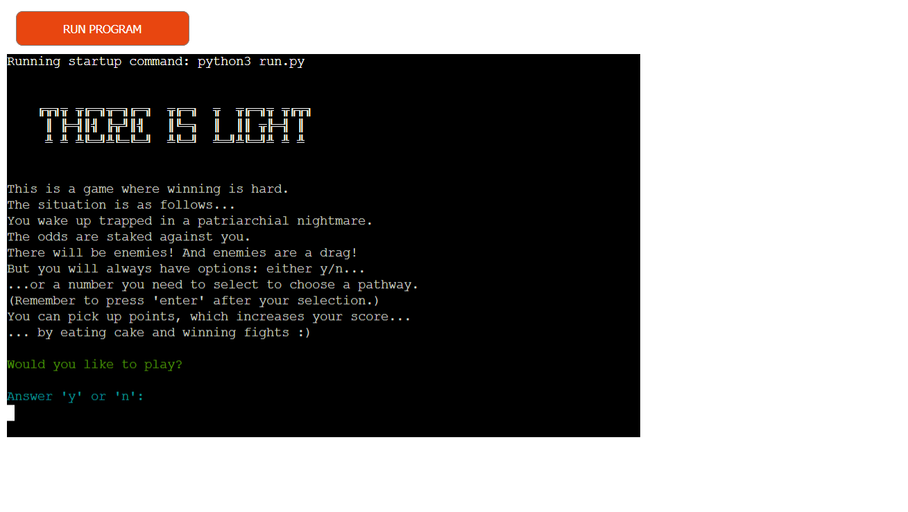
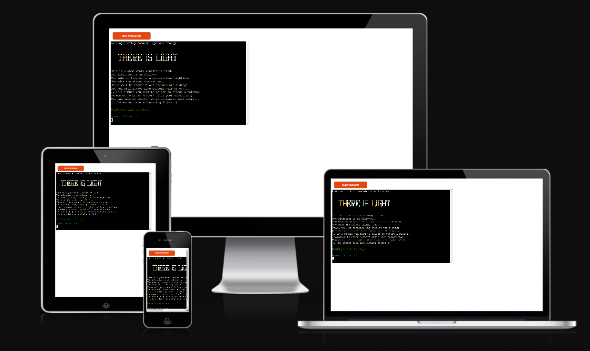
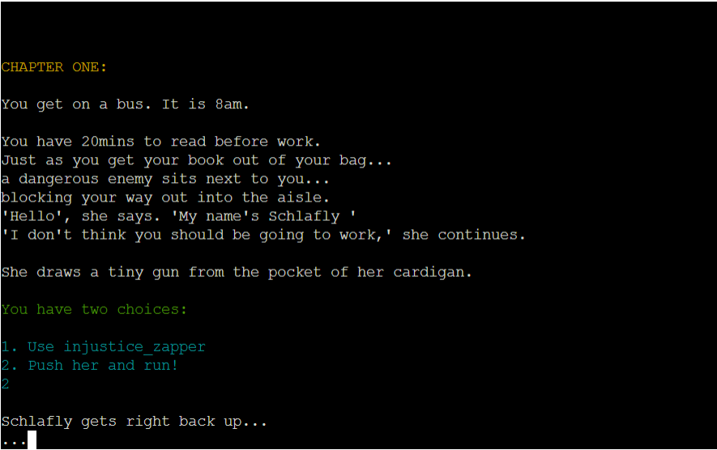
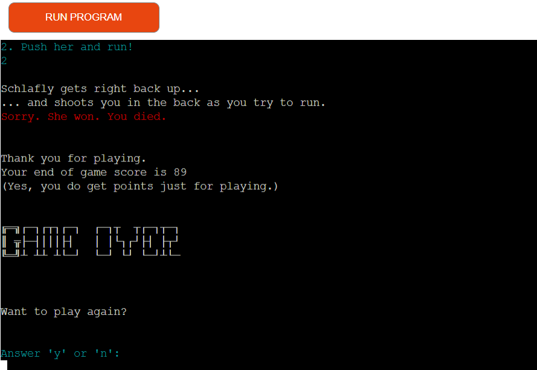
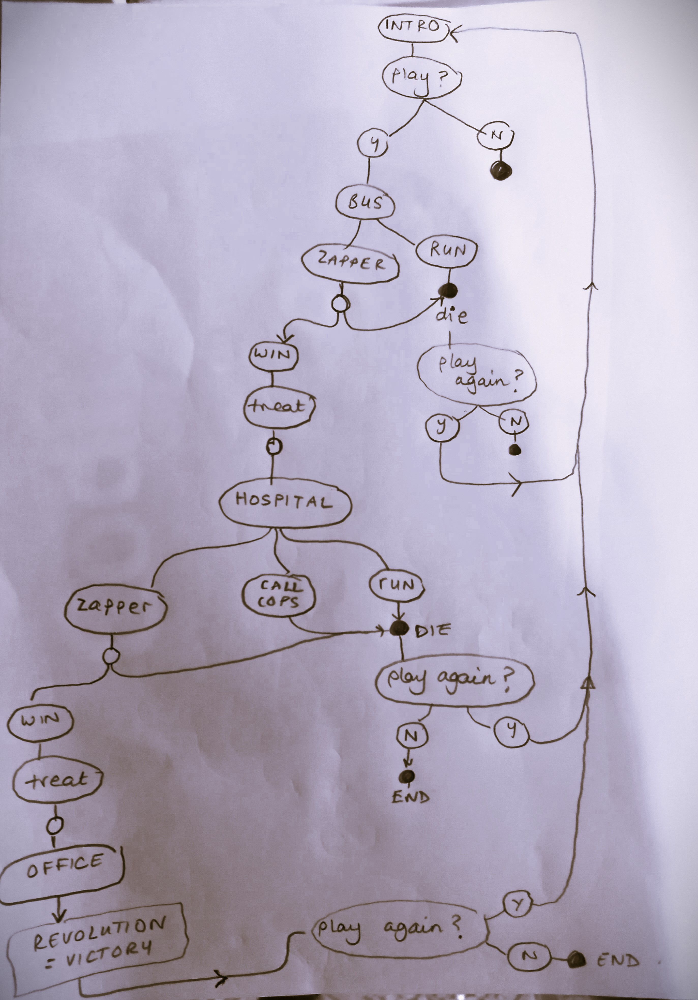
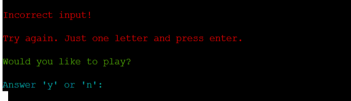
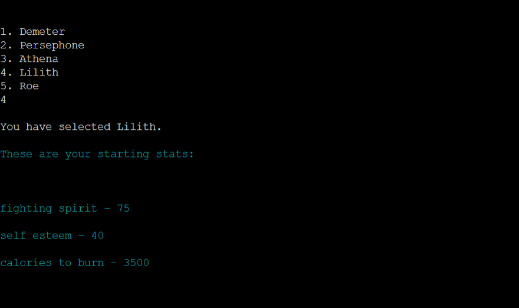

**THERE IS LIGHT - A choose your own text adventure using Python**

## Table of contents for this README 
* [Introduction](#there-is-light)
* [Links](#links)
* [User Experience](#user-experience)
* [Logic](#logic)
* [Design](#design)
* [Features](#features)
* [Technologies Used](#technologies-used)
* [Testing](#testing)
* [Bugs](#bugs)
* [Future Improments](#future-improvements)
* [Deployment](#deployment)
* [Credits](#credits)
* [Acknowledgements](#acknowledgements)

## There Is Light

This is a choose your own text adventure based on some of the games I played in the 80s, in my after-school computer club.

There is a twist, however. The setting is a humourous one with a small bit of seriousness. 'You wake up in a patriarchial nightmare,' is the premise, and the enemies through the game share their surnames with figures who have obstructed women's reproductive rights in the USA. The setting is dystopian, and the game 'is hard', with most paths leading to the obliteration of the female protagonist. The player can choose one of five characters to be, each with their own stats/ strengths. These five characters are named after female mythological figures (e.g. the goddess Athena). The one exception is 'Roe', after the legal pseudonym of the woman involved in the Roe Vs Wade landmark case in the USA. 

The characters pick up points by eating cake, drinking coffee or beating their enemies in battles that take place on a bus to work, outside a hospital and in the office where the character works.

The wry and statistically unlikely outcome, determined by poor odds that I deliberately put in place using the Python import 'random', is a successful revolution. This outcome, when selected, ends with a quote from the poem 'The Laughing Heart' by Charles Bukowski ("There's a light somewhere/ It may not be much light/ but it beats the darkness"). It is the inspiration for the title of the game.

Above is a screenshot of the the opening text, showing the title, the set-up and the tone of the adventure. 

## **Links**

[Live link for game](https://thelaughingheart.herokuapp.com)

[Link to the GitHub repo](https://github.com/farah-maria/ThereIsLight)

## **User Experience, Scope & Design**

### Design responsivity

Design responsivity to different screen sizes was not part of the brief for this project, and it’s therefore outside of the intended scope. However, a user can play the game and access all features on a phone, tablet, laptop or desktop. In the case of playing on a phone, the game is best played in landscape. In portrait, on a mobile phone, the content is accessible, but scrolling to the right to read the end of sentences is required. Below is how the game looks on different types of screen resolutions. 

Deployment via Heroku was a required aspect of this project, which has its limitations, as well as the fact that this is a pure Python project.

## General design

Within the constraints of the project brief, I used four main methods to affect the appearance of the game. 

The first was that I imported the external library Colorama so that I could change the colour of the text. The main bulk of the text is white, as this has the best constrast against the black background of the console. Green is generally used throughout for questions posed to the user, as it's quite a neutral colour. Cyan is used to show/ type-up answers as a result of player input or a chance event triggered by their behaviour in the game. Cyan contrasts more strongly against a black background than colorama's version of blue, so it was chosen for readability/ accessability.  Red is used when the player has lost (indicating warning/ blood, as is generally the case in signage through everyday life). Yellow is for chapter headings. 

The colour adds a little variety, and the way it's used through the game gives a level of consistency in design, helping the user know what to expect from different types of text.

The second design feature I used were heading designs for the title and 'game over' sections. These were copied and pasted from (http://patorjk.com). 

The third, more subtle design aspect I used was a liberal use of spacing, so that the player isn't completely overwhelmed by text, even though it is a text adventure. Colour, spacing and the timing of the letters appearing on the screen were the main things I used to add "spice" to an otherwise plain looking screen. Timing was the fourth and last design feature I used in the game. The slow_read effect that I used meant that certain parts of the the story appear more slowly, and the words appear letter by letter in the console, to add suspense and add a 'typewriter' effect. This typewriter effect is intended to give the game an extra retro feel for the days of text adventures, when typewriters were still in use in offices. The Time module was imported so that pauses (via the "time.sleep" method) could be put into the text, while other parts had no pauses at all and appeared faster to let the narrative pick up pace.   

'Chapters' are used in the story, and there is a fair bit of text, as I'm a writer and I wanted to give the game a bookish feel. The content was all written by me.

### User Stories:

#### As the site creator, my aim was to:

* Create a simple game app using python that allows users to interact with the game.
* Build a game that is fun and interesting for users to complete.

#### As a first time user:

* I want the purpose of the game to be clear from the start. i.e. what defines success/ winning (e.g. fighting a monster and beating her/ him.) 

* I want to know what the objectives of the game, in terms of the journey to the end (e.g. picking up points, or treasure, who my friends and enemies are.)  

* I want clarity in how to play the game, and a clear sense of the rules of the game.

* I want to enjoy the adventure and get a sense of satisfaction from doing well at it.

* If I lose, I want the reason for that to be clear (e.g. "You ran out of points.")

* I would like there to be some friendliness to the same (e.g. be greeted as the user, and get something like a "Better luck next time and thank you for playing at the end.")

  
#### As a returning user:  

* I would like to explore alternative paths through the choose-your-own-adventure.
* I would like to find a way of winning the game or improving on my score compared to last time.
* For the above reason, I might like a record of my past scores to be in the game, so I can see if I did better.
* I might like to see how other players have done, so I can compare my score.
* Try to compete with other players and my own past score.

## Logic

* Below is a hand-drawn flowchart that shows the paths that can be taken through the game.
 
     </right>
 

A black circle indicates the player has lost or the game has ended. A white circle indicates where the random import is used in Python to introduce an element of chance to the outcome. As stated in the opening of the game 'the stakes are against' the player winning.

Most story paths lead to defeat, but one leads to a revolution for better odds. If the player plays often enough, chance should ensure that s/he will reach this at some point, after a good deal of frustration. :)

Story paths are chosen by the user either by entering 'y' or 'n' for yes or no questions, or by entering a number to choose from an offered selection of pathways. 

Simplicity is at the heart of the basic navigation structure: yes or no, or a number.

## Existing Features
### Features

1. Users are greeted with the title logo and introduction to the game. Following the user experience stories as a guide to what's needed in the structure of the game, the intro tells the player what the game is, what their chances of success are, what success entails, whether there will be opponents and how they can pick up points to build their score. The player is also told how to navigate the game/ interact with it. The 'Would you like to play?' question invites them in and informs them of their interative role in the game right from the start.

2. When the player types in an option that is a typo or isn't a valid selection, an error message comes up and the user is asked the question again, so that the game can resume with minimum interruption. Throughout the game, errors are handled in this way and loop back  to the question.

3. The player can choose which character to play in the game, adding even more possible paths, as each character has their own 'stats' which affects the player's final score. There is added potential for the returning user to explore more paths, playing a different character each time.

4. The stories is separated into chapters, as in a book, giving the player a sense of progression and direction through the the adventure. There are four chapters. Chapter one is set on a bus to work. If the player survives the enemy on the bus, chapter two leads them to a 'treat' from the cafe opposite the character's workplace. Chapter three is set outside a hospital, after the character slips and injures herself outside the cafe. If the character survives Trump's attempts to stop them getting healthcare, they move on to chapter four, where they go to work. Here, they encounter an enemy in the office but also a great deal of solidarity from their colleagues (this path ends in victory).

5. The story features an anti-injuctice zapper, which is an option a couple of times in the story. If used, the character's odd of winning or being tripped up in some way are dictated by odds determined within the code, with an element of chance. 

The treats are also determined by chance in this way (using the 'random' library imported into Python), and the element of different outcomes from the flipping of a coin, for example, in the story, means that the returning user can experience different 'perks' in the plot without even selecting a different path. 

6. The possible deaths are generally amusing.

7. The player is given the option of playing again whenever they die, and if they select 'y' the game loops back to the start. 

8. The player starts with a set of strengths, and this determines their starting score. They can gain or lose points relating to their score by defeating an enemy or, by chance, eating a treat/ drinking coffee. This "quest" type set-up, with various scoring functions through the game, some of them determined by chance, others by their actions, and some by both, was borrowed from the series of classes called 'Python Text adventure [EASY!]' on the YouTube channel 'Learn to Code GCSE'. (https://www.youtube.com/watch?v=5a1KJPHPImc&ab_channel=LearntoCodeGCSE).  

9. The enemy can also lose points by taking a hit by the player, which is a feature for future development.

10. The scoring function was set up, along with an API link to a google scoresheet, to build in the potentiality for the creation of a leaderboard (see below).

### Future Features:
* I had set up linking externally to Google Sheet API and the functionality was to retrieve the password from the Google Sheet rather than the password.py file. I reverted back as felt this was adding unnecessary complexity to the project as the current password.py file worked as expected.
* Add a leaderboard and Log users details to the Google Sheet.
## **Testing (and bugs!)**

Two key aspects of this project are accessibility and design responsivity (media queries). To test for accessibility, I used the Lighthouse report generator in Chrome dev tools to check that the accessibility scores for the desktop and mobile versions of the site were over 70%. 

 

   

 

   

The screenshots of the report are above. The first one is for the desktop version and the second one for mobiles. Despite my efforts to start from scratch a week into the project with a mobile first approach, it is the desktop version that scores most highly on all-round performance. The specific score for accessibility is 97%. The mobile version has the same score, with both versions of the site - mobile and desktop - also scoring 100% on best practice. This meant that thankfully, I did not have to go back to the drawing-board for this project. The accessibility scores are well above 70%.

I also tested the site on real devices by checking how it looked on my phone (Huawei P30 lite), my friends' devices (I asked them send me screenshots), my tablet (Surface Go) and by checking all of the most common screen sizes from the smallest size of 320 x 480 pixels (the dimensions for the iphone4). I also tested the points at which the integrity of the webpages fell apart using Chrome dev tools. I used these to guide the creation of further media queries in my CSS code to remedy the 'glitches', so that when I played with the width and height in Chrome dev tools, the design seamlessly adapted. I learned about this adaptive approach from a 'Sam's Teach Yourself' textbook that I have on CSS and HTML. "Focus your breakpoints on where your design starts to fail rather than worrying about specific devices or widths. It's also a good idea to strive for as few breakpoints as your design can handle and not be broken" (p.468, Colburn, Kyrnin & Lemay 2016). If I could go back and do this project again, I would certainly aim for less media queries. The feedback form in particular required a lot of adjustments in CSS for different screen sizes, and even though the code "works" and my course mentor was happy with the design responsivity for all of the pages of the site, I could have saved a lot of time and effort if I simply taught myself CSS grids and used this for the whole of the feedback page.

I noticed early on that Chrome dev tools do not show how a site looks like on a given device in real life. This is because the browser adds elements to the top and the bottom of the page, and these are difficult to predict it varies with different browsers. When I tested the homepage on my phone, the footer dropped off the screen, but it was visible for the same dimensions in Chrome dev tools. I was told, for the sake for how this project is being assessed, to focus on what is shown by Chrome dev tools. However, I couldn't leave it alone, because I want this site to be of actual real-life use. I have coded the footer to come up higher on mobile devices so that it is always visible. It turns out that this makes the footer stand out more on smaller screens, so it probably pushed up the accessibility score on the Lighthouse report.   

The timeline code turned out to not work in its entirety on different devices after it had been amended by me to include images and different fonts/ colours. Specifically, there was a join in the timeline that was visibly out of alignment. I used Chrome dev tools to click on this, and discover which bit of code needed amending. A similar issue came up that related to the dots on the timeline. They were not on the actual timeline, but floating off away from the descriptions about each woman in history. I found the bug in the same way and created a series of media queries that fix this for different screen sizes.

I tested all of the links on the history line to make sure they were up to date and functional when clicked on. A bug that came up initially was that some of the links didn't work. The 'position: relative' style automatically gave the elements a z-index, so part of the div element was covering the link, making it unclickable. I worked this out with the help of a tutor. My adding 'position: relative' to the style for the links in CSS, this got fixed.

 ## **Code Validation**

 The HTML for the landing page, the timeline page and the feedback page all passed when I copied and pasted the code into the free w3 validator service online. The screenshots are below.  

 

   

 

 

 

 

The CSS code for the website also passed when it was cut and paste into the Jigsaw w3 validation service online. The screenshot showing this is below.

 

 

No errors were found in the HTML or the CSS code when tested two days prior to the submission of this project. Before this, however, there were some bugs I needed to swat! A few errors were found by the validator that I had to fix. It turned out that my history timeline was riddled with tags that were not closed properly... Below is an example.

 

 

I went through the HTML with a fine toothcomb and discovered the problem. I was trying to wrap block elements with inline elements, and this meant that my paragraphs weren't closing properly. I fixed this, and correctly ordered my tags. I removed the use of divs to style the links embedded in various paragraphs, remembering that divs are used as outer-wrappers. I needed to be using the span element to style these links instead. My code passed after making these changes.

## **Deployment**

I used GitHub pages to deploy my site. The process is simple. Click on 'settings' after going into the repository and scroll down. The menu down the lefthand side will have an option called 'pages'. Click on this, and after a few moments the site will be deployed and GitHub will automatically show a web address in blue. This is the address for the live site, which anyone can now access from their own devices.

## **Acknowledgements**

1. Am I Responsive? (https://amiresponsive.co.uk/) This free site illustrates how your web project looks on different devices in an attractive way.

2. Google Fonts. (https://fonts.google.com/) 

3. Canva. (canva.com/learn/best-google-font-combinations).

4. Font Awesome. (https://fontawesome.com/)

5. Hero image by @lum3n on Unsplash [Unsplash web address](https://unsplash.com/photos/-RBuQ2PK_L8).

6. Digital papers used as backgrounds throughout the site originally sourced from Creative Tacos (https://creativetacos.com/). 

7. Code for timeline inspired by https://alvarotrigo.com/blog/html-css-timelines. I added floating images and different fonts, which meant that I had to edit the code.

8. All images for the timeline are open source and from Wikimedia Commons (https://commons.wikimedia.org/wiki/Main_Page). 

9. W3 schools "HOW TO - Responsive Form" at http://www.w3schools.com/howto/howto_css_responsive_form.asp/.

10. 'Website Dimensions: These are the 15 Most Common 15 Screen Resolutions to Design for'. Design Rush. Updated 05/05/2022. https://www.designrush.com/agency/web-development-companies/trends/website-dimensions

11. Chrome developer tools, including Lighthouse. https://developer.chrome.com/docs/lighthouse/overview/

12. W3C Markup Validation Service (https://validator.w3.org/index.html)

13. W3C Jigsaw CSS Validation Service (https://jigsaw.w3.org/css-validator/)

14. Colborn, R. Kyrnin, J. & Lemay, L. (2016) Sam's Teach Yourself HTML, CSS & JavaScript: Web Publishing in One Hour a Day. Pearson Education, Indiana.

15. Information about the history of female coders was from a range of sources, including the Encyclopaedia Britannica online (https://www.britannica.com/). I also watched the wonderful 2016 film, Hidden Figures, and took notes. Links to articles, YouTube videos and audio can be found on the timeline page of the site, with acknowledgements also below...

16. Jones, B. & Larson, L. (2019)'Long before Gates or Jobs, 6 women programmed the first digital computer', Digital Trends, https://www.digitaltrends.com/computing/remembering-eniac-and-the-women-who-programmed-it/

17. Shetterly, M. L. NASA biography of Katherine Johnson, https://www.nasa.gov/content/katherine-johnson-biography/. 

18. Women's Stories, (2014) 'Who is Grace Hopper?', https://youtube.be/Fg82iV-L8ZY (video).

19. STEM for Success, (2021) Valerie Thomas: Transmitting the Future, https://www.youtube.com/watch?v=EWBlW1xgAow. 

20. Lantero, A. (2016) 'Five Fast Facts About Rocket Scientist Annie Easley' https://www.energy.gov/articles/five-fast-facts-about-rocket-scientist-annie-easley

21. Youtube interview with "Hidden Figures" author Margot Lee Shetterly: https://www.youtube.com/watch?v=PdbPkCGUq9k

22. Biography magazine (2016) 'Dorothy Johnson Vaughan', https://www.biography.com/scientist/dorothy-johnson-vaughan
