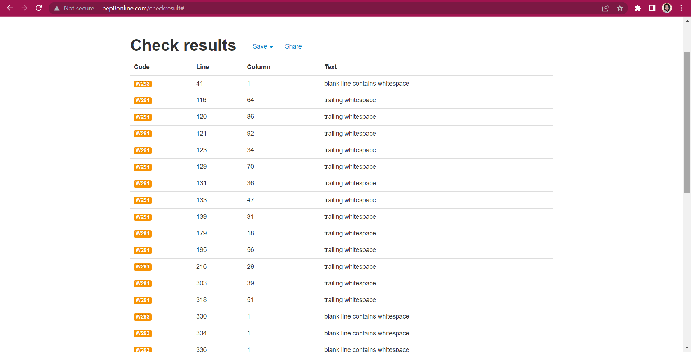

**THERE IS LIGHT - A choose your own text adventure using Python**

## Table of contents for this README 
* [Introduction](#there-is-light)
* [Links](#links)
* [User Experience](#user-experience)
* [Logic](#logic)
* [Design](#design)
* [Features](#features)
* [Technologies Used](#technologies-used)
* [Testing](#testing)
* [Bugs](#bugs)
* [Future Improments](#future-improvements)
* [Deployment](#deployment)
* [Credits](#credits)
* [Acknowledgements](#acknowledgements)

## There Is Light

This is a choose your own text adventure based on some of the games I played in the 80s, in my after-school computer club.

There is a twist, however. The setting is a humourous one with a small bit of seriousness. 'You wake up in a patriarchial nightmare,' is the premise, and the enemies through the game share their surnames with figures who have obstructed women's reproductive rights in the USA. The setting is dystopian, and the game 'is hard', with most paths leading to the obliteration of the female protagonist. The player can choose one of five characters to be, each with their own stats/ strengths. These five characters are named after female mythological figures (e.g. the goddess Athena). The one exception is 'Roe', after the legal pseudonym of the woman involved in the Roe Vs Wade landmark case in the USA. 

The characters pick up points by eating cake, drinking coffee or beating their enemies in battles that take place on a bus to work, outside a hospital and in the office where the character works.

The wry and statistically unlikely outcome, determined by poor odds that I deliberately put in place using the Python import 'random', is a successful revolution. This outcome, when selected, ends with a quote from the poem 'The Laughing Heart' by Charles Bukowski ("There's a light somewhere/ It may not be much light/ but it beats the darkness"). It is the inspiration for the title of the game.

Above is a screenshot of the the opening text, showing the title, the set-up and the tone of the adventure. 

## **Links**

[Live link for game](https://thelaughingheart.herokuapp.com)

[Link to the GitHub repo](https://github.com/farah-maria/ThereIsLight)

## **User Experience, Scope & Design**

### Design responsivity

Design responsivity to different screen sizes was not part of the brief for this project, and it’s therefore outside of the intended scope. However, a user can play the game and access all features on a phone, tablet, laptop or desktop. In the case of playing on a phone, the game is best played in landscape. In portrait, on a mobile phone, the content is accessible, but scrolling to the right to read the end of sentences is required. Below is how the game looks on different types of screen resolutions. 

Deployment via Heroku was a required aspect of this project, which has its limitations, as well as the fact that this is a pure Python project.

## General design

Within the constraints of the project brief, I used four main methods to affect the appearance of the game. 

The first was that I imported the external library Colorama so that I could change the colour of the text. The main bulk of the text is white, as this has the best constrast against the black background of the console. Green is generally used throughout for questions posed to the user, as it's quite a neutral colour. Cyan is used to show/ type-up answers as a result of player input or a chance event triggered by their behaviour in the game. Cyan contrasts more strongly against a black background than colorama's version of blue, so it was chosen for readability/ accessability.  Red is used when the player has lost (indicating warning/ blood, as is generally the case in signage through everyday life). Yellow is for chapter headings. 

The colour adds a little variety, and the way it's used through the game gives a level of consistency in design, helping the user know what to expect from different types of text.

The second design feature I used were heading designs for the title and 'game over' sections. These were copied and pasted from (http://patorjk.com). 

The third, more subtle design aspect I used was a liberal use of spacing, so that the player isn't completely overwhelmed by text, even though it is a text adventure. Colour, spacing and the timing of the letters appearing on the screen were the main things I used to add "spice" to an otherwise plain looking screen. Timing was the fourth and last design feature I used in the game. The slow_read effect that I used meant that certain parts of the the story appear more slowly, and the words appear letter by letter in the console, to add suspense and add a 'typewriter' effect. This typewriter effect is intended to give the game an extra retro feel for the days of text adventures, when typewriters were still in use in offices. The Time module was imported so that pauses (via the "time.sleep" method) could be put into the text, while other parts had no pauses at all and appeared faster to let the narrative pick up pace.   

'Chapters' are used in the story, and there is a fair bit of text, as I'm a writer and I wanted to give the game a bookish feel. The content was all written by me.

### User Stories:

#### As the site creator, my aim was to:

* Create a simple game app using python that allows users to interact with the game.
* Build a game that is fun and interesting for users to complete.

#### As a first time user:

* I want the purpose of the game to be clear from the start. i.e. what defines success/ winning (e.g. fighting a monster and beating her/ him.) 

* I want to know what the objectives of the game, in terms of the journey to the end (e.g. picking up points, or treasure, who my friends and enemies are.)  

* I want clarity in how to play the game, and a clear sense of the rules of the game.

* I want to enjoy the adventure and get a sense of satisfaction from doing well at it.

* If I lose, I want the reason for that to be clear (e.g. "You ran out of points.")

* I would like there to be some friendliness to the same (e.g. be greeted as the user, and get something like a "Better luck next time and thank you for playing at the end.")

  
#### As a returning user:  

* I would like to explore alternative paths through the choose-your-own-adventure.
* I would like to find a way of winning the game or improving on my score compared to last time.
* For the above reason, I might like a record of my past scores to be in the game, so I can see if I did better.
* I might like to see how other players have done, so I can compare my score.
* Try to compete with other players and my own past score.

## Logic

* Below is a hand-drawn flowchart that shows the paths that can be taken through the game.
 
     </right>
 

A black circle indicates the player has lost or the game has ended. A white circle indicates where the random import is used in Python to introduce an element of chance to the outcome. As stated in the opening of the game 'the stakes are against' the player winning.

Most story paths lead to defeat, but one leads to a revolution for better odds. If the player plays often enough, chance should ensure that s/he will reach this at some point, after a good deal of frustration. :)

Story paths are chosen by the user either by entering 'y' or 'n' for yes or no questions, or by entering a number to choose from an offered selection of pathways. 

Simplicity is at the heart of the basic navigation structure: yes or no, or a number.

## Existing Features
### Features

1. Users are greeted with the title logo and introduction to the game. Following the user experience stories as a guide to what's needed in the structure of the game, the intro tells the player what the game is, what their chances of success are, what success entails, whether there will be opponents and how they can pick up points to build their score. The player is also told how to navigate the game/ interact with it. The 'Would you like to play?' question invites them in and informs them of their interative role in the game right from the start.

2. When the player types in an option that is a typo, or an empty space, or isn't in general a valid selection, an error message comes up and the user is asked the question again, so that the game can resume with minimum interruption. Throughout the game, errors are handled in this way and loop back  to the question.

3. The player can choose which character to play in the game, adding even more possible paths, as each character has their own 'stats' which affects the player's final score. There is added potential for the returning user to explore more paths, playing a different character each time.

4. The stories is separated into chapters, as in a book, giving the player a sense of progression and direction through the the adventure. There are four chapters. Chapter one is set on a bus to work. If the player survives the enemy on the bus, chapter two leads them to a 'treat' from the cafe opposite the character's workplace. Chapter three is set outside a hospital, after the character slips and injures herself outside the cafe. If the character survives Trump's attempts to stop them getting healthcare, they move on to chapter four, where they go to work. Here, they encounter an enemy in the office but also a great deal of solidarity from their colleagues (this path ends in victory - see below).

5. The story features an anti-injuctice zapper, which is an option a couple of times in the story. 

If used, the character's odd of winning or being tripped up in some way are dictated by odds determined within the code, with an element of chance, thanks to the imported library 'random'. The treats are also determined by chance in this way (using the 'random' library imported into Python), and the element of different outcomes from the flipping of a coin, for example, in the story, means that the returning user can experience different 'perks' in the plot without even selecting a different path. 

6. The possible deaths are generally amusing, as are the perks.

7. The player is given the option of playing again whenever they die, and if they select 'y' the game loops back to the start. 

8. The player starts with a set of strengths, and this determines their starting score. They can gain or lose points relating to their score by defeating an enemy or, by chance, eating a treat/ drinking coffee. This "quest" type set-up, with various scoring functions through the game, some of them determined by chance, others by their actions, and some by both, was borrowed from the series of classes called 'Python Text adventure [EASY!]' on the YouTube channel 'Learn to Code GCSE'. (https://www.youtube.com/watch?v=5a1KJPHPImc&ab_channel=LearntoCodeGCSE).

9. The enemy can also lose points by taking a hit by the player, which is a feature that can be taken further for future development.

10. The scoring function was set up, along with an API link to a google scoresheet, to build in the potentiality for the creation of a leaderboard (see below under future features section). The googlesheet has already been set up with an automatic ranking function that orders the players stats by how high their score is/ was.

### Future Features:

* Add a leaderboard and scoresheet to the game. Player is asked for their first name or nick-name as part of the game, as part of the score_end() function, and this is recorded along with their score.

* Develop the story with Kavanaugh, as his points Vs the the points of the main character haven't been challenged through an actual battle yet. I ran out of time!

* Use the stats of heroines in unique ways through the storyline. The calories have been used effectively, but self-esteem could be used more specifically in an interesting way through the story... i.e. it could add to their defences when under attack and help them survive.

* Add images to the game.

* Add design responsivity for phones. The app isn't visible at all on some iphones (I tested it).

* Give user the option to choose difficulty of game. Easier version would have better odds of winning in the code, but with the same story. This could ease the frustration of it being a little too hard to win.

## **Testing (and bugs!)**

I sent the link for the game to several friends to see if they were coming up against any errors. Numerous errors came up! Most related to one part of the story not leading to another after a user input, or the wrong storyline coming up for the number selected, or to a situation where a loop was created and the same question was being asked of the player again and again or the same text was coming up (see below).

In the above case, the function was being called in more than one place in the code unnecessarily. And most of these issues either related to the logic in the code, where a function was being called twice in the different parts of the code by mistake, or to typos. I sent the deployed link to a friend, for example, and he found that choosing option two when encountering Trump outside the hospital was actually leading to the consequences for option 3. It turned out that my 'elif' for option two didn't have quotation marks around it. I'd forgotten to put them in. So, that part of the code was referring to an integer 2 rather than the string "2", and the program, when run, just ignored it and went to the 'else' option, which was option 3.  

I encountered extensive issues when deploying via Heroku, also. And no one really worked out what the issue was, other than that it looked like it was an issue on Heroku's side. I kept getting the following screen when opening the app in Heroku:

 My code was deployed as it was, unchanged, successfully, using a different Heroku account set up using a different email address. The app was deleted and recreated a number of times in Heroku, too, and this is why my link for the deployed app isn't similar in any way to the name of the game or the Github link for its code. 

## **Code Validation**

I used the PEP8 online code checker, found at (http://pep8online.com/), to check that my Python code was up to standard. I coped and pasted my Python code into the box, and my code passed in so far as there weren't any 'red' warnings, apart from one regarding a simple spacing issue (I needed to add a blank line after a function) that was easily resolved.

My use of matchcase in a Python function was also fine in PEP8, but GitPod didn't have the version of Python to deal with it, and after various attempts to install Python.10, I ended up commenting out my use of matchcase (even though it's recommended for functions with lots of 'elif's). This is my function called heroine_selection(), which has five character options. So, despite being validated via PEP8, I had to change the code back due to GitPod. 

 
## **Deployment**

The project was deployed using Heroku.

I had many issues deploying, unfortunately, but normally it shouldn't be too difficult. 

The process is simpler where there are no APIs, but I do have a creds.json file for an API set up to make the app ready for a few future features.

The stages are as follows:

Create an account or log-in to Heroku on Heroku.com

There are now extra requirements for security, so you may need to download a salesforce password validator app on your phone using googleplay. (This is what I had to do, or Heroku wouldn't allow me to add the buildpacks for Python and Node.Js) 

Press the button where it says you can create a new app.

Go to 'settings'. Even if you do not have an API to link with the app,
go to vars and enter the following key/ value pair:

PORT + 8000

If you have an api, add another key/ value pair:

CREDS + {cut and paste ALL code from your creds.json file}

Now, on the same page, there's the option to add buildpacks. These need to be built in this specific order: first of all, Python (press save), then Nodejs (press save). Python should appear above Nodejs on the list of added buildpacks.

Now, go to the 'deploy' page.

Link your project via Github, here, and choose the right repo.

Click on 'enable automatic deployment'

You may need to make a change in GitPod and commit & push it (even if it's just an extra space somewhere in your README) after this process in order to trigger automatic deployment.

Press the 'open app' button and you should see your app in all it's glory (or not!). You can get your deployed link here, or it should be in green on the deply page after a few minutes.

## **Acknowledgements**

1. Am I Responsive? (https://amiresponsive.co.uk/) This free site illustrates how your web project looks on different devices in an attractive way.

2. Google Fonts. (https://fonts.google.com/) 

3. Canva. (canva.com/learn/best-google-font-combinations).

4. Font Awesome. (https://fontawesome.com/)

5. Hero image by @lum3n on Unsplash [Unsplash web address](https://unsplash.com/photos/-RBuQ2PK_L8).

6. Digital papers used as backgrounds throughout the site originally sourced from Creative Tacos (https://creativetacos.com/). 

7. Code for timeline inspired by https://alvarotrigo.com/blog/html-css-timelines. I added floating images and different fonts, which meant that I had to edit the code.

8. All images for the timeline are open source and from Wikimedia Commons (https://commons.wikimedia.org/wiki/Main_Page). 

9. W3 schools "HOW TO - Responsive Form" at http://www.w3schools.com/howto/howto_css_responsive_form.asp/.

10. 'Website Dimensions: These are the 15 Most Common 15 Screen Resolutions to Design for'. Design Rush. Updated 05/05/2022. https://www.designrush.com/agency/web-development-companies/trends/website-dimensions

11. Chrome developer tools, including Lighthouse. https://developer.chrome.com/docs/lighthouse/overview/

12. W3C Markup Validation Service (https://validator.w3.org/index.html)

13. W3C Jigsaw CSS Validation Service (https://jigsaw.w3.org/css-validator/)

14. Colborn, R. Kyrnin, J. & Lemay, L. (2016) Sam's Teach Yourself HTML, CSS & JavaScript: Web Publishing in One Hour a Day. Pearson Education, Indiana.

15. Information about the history of female coders was from a range of sources, including the Encyclopaedia Britannica online (https://www.britannica.com/). I also watched the wonderful 2016 film, Hidden Figures, and took notes. Links to articles, YouTube videos and audio can be found on the timeline page of the site, with acknowledgements also below...

16. Jones, B. & Larson, L. (2019)'Long before Gates or Jobs, 6 women programmed the first digital computer', Digital Trends, https://www.digitaltrends.com/computing/remembering-eniac-and-the-women-who-programmed-it/

17. Shetterly, M. L. NASA biography of Katherine Johnson, https://www.nasa.gov/content/katherine-johnson-biography/. 

18. Women's Stories, (2014) 'Who is Grace Hopper?', https://youtube.be/Fg82iV-L8ZY (video).

19. STEM for Success, (2021) Valerie Thomas: Transmitting the Future, https://www.youtube.com/watch?v=EWBlW1xgAow. 

20. Lantero, A. (2016) 'Five Fast Facts About Rocket Scientist Annie Easley' https://www.energy.gov/articles/five-fast-facts-about-rocket-scientist-annie-easley

21. Youtube interview with "Hidden Figures" author Margot Lee Shetterly: https://www.youtube.com/watch?v=PdbPkCGUq9k

22. Biography magazine (2016) 'Dorothy Johnson Vaughan', https://www.biography.com/scientist/dorothy-johnson-vaughan
